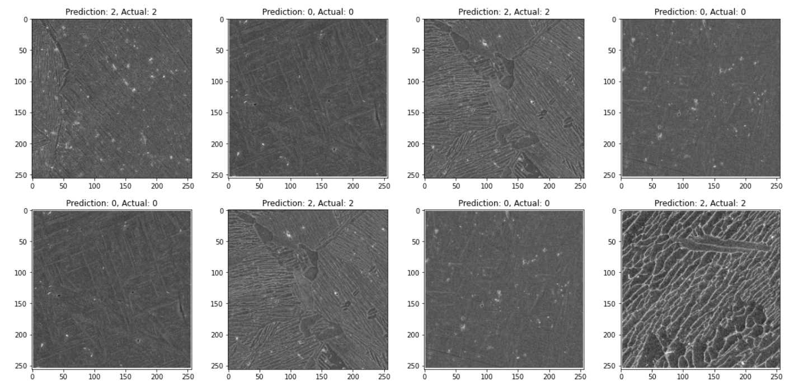

# Titanium Classifier

Uses a convolution neural network to classify titanium microstructures

Obtained test accuracy of 96%

Microstructures and labels used are not mine and belong to the rightful owner, Arun Baskaran.
Read their paper and see their microstructures here:
https://doi.org/10.1016/j.commatsci.2020.109593
https://github.com/ArunBaskaran/Image-Driven-Machine-Learning-Approach-for-Microstructure-Classification-and-Segmentation-Ti-6Al-4V

